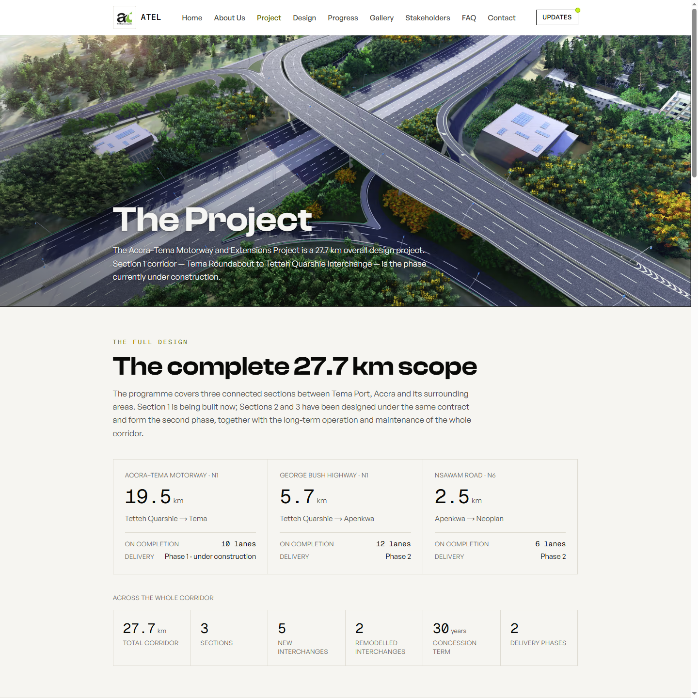
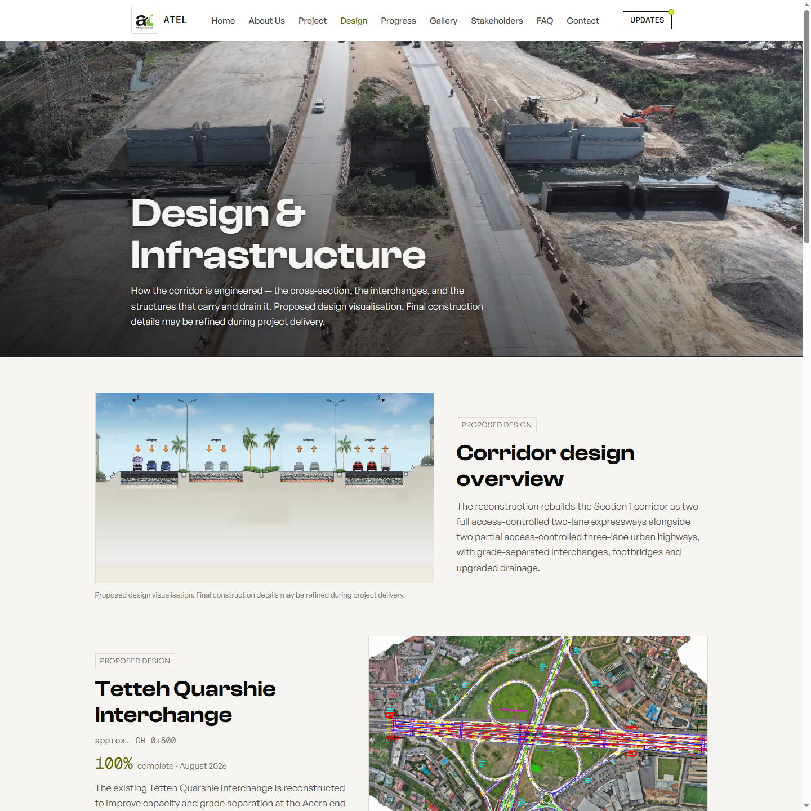
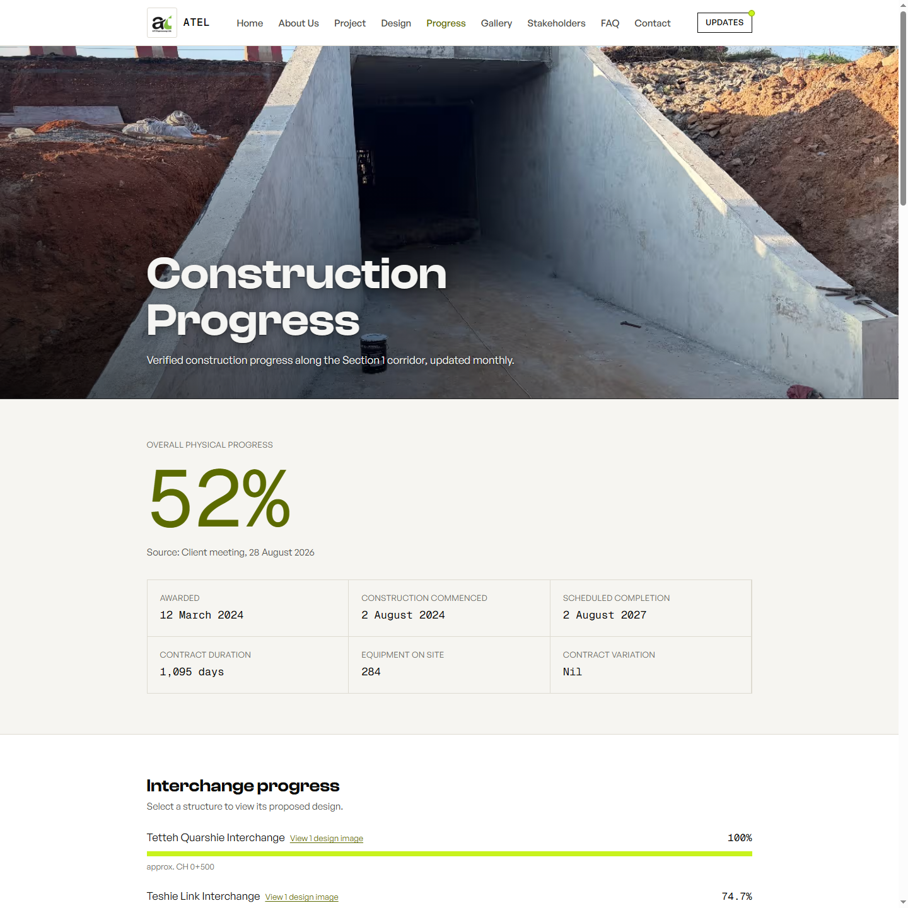
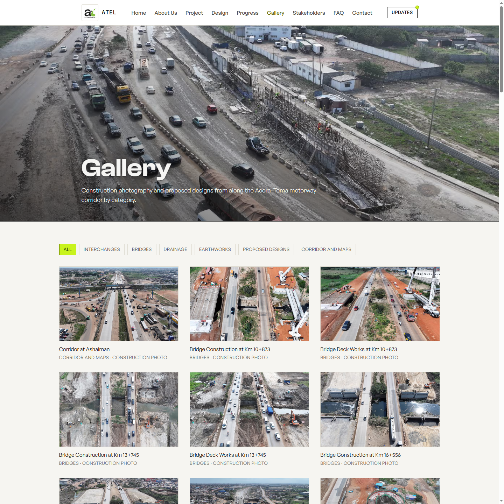
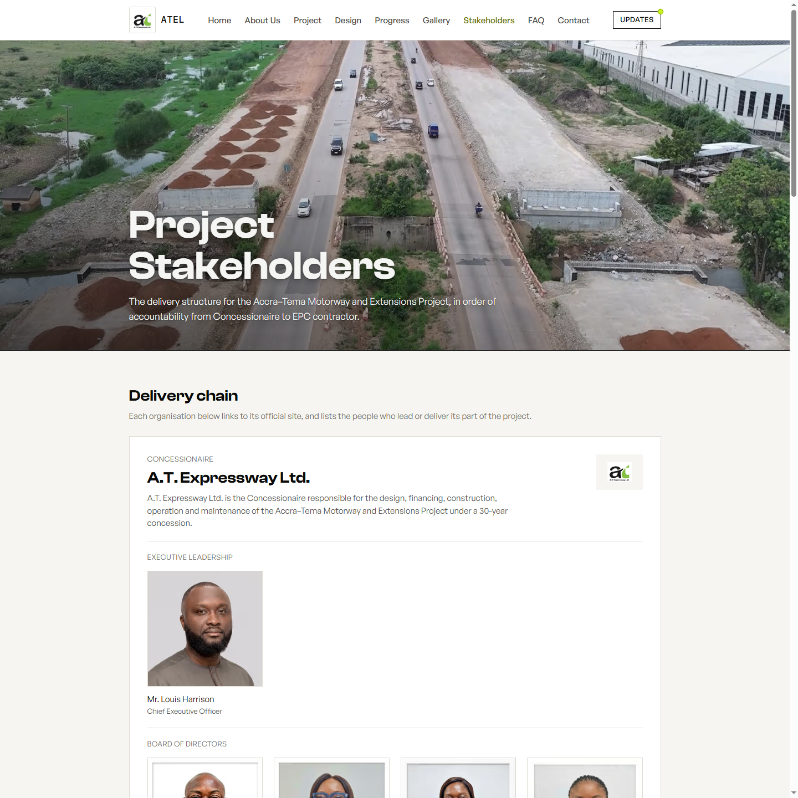
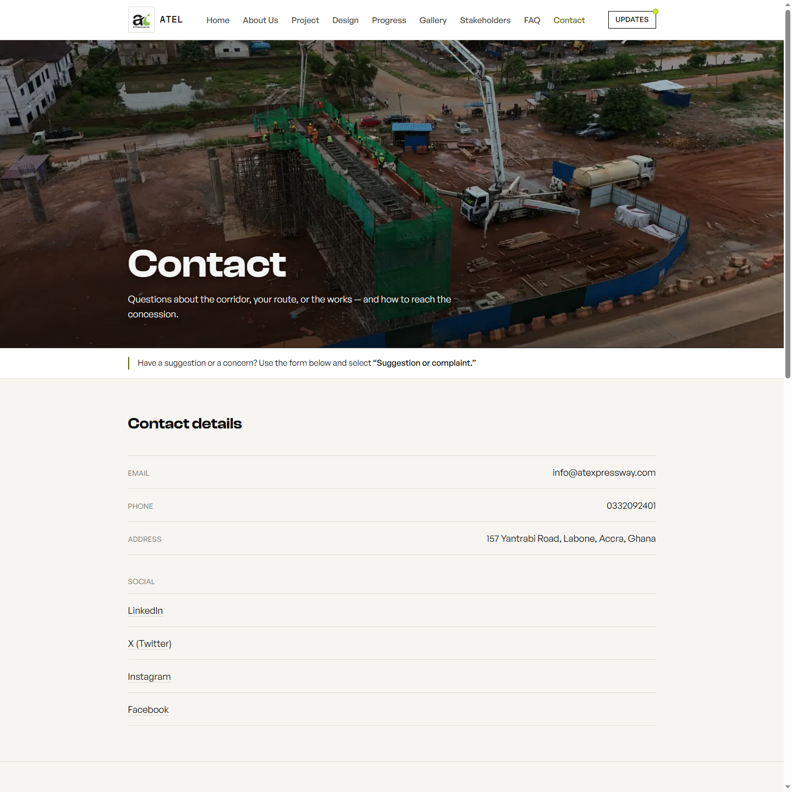
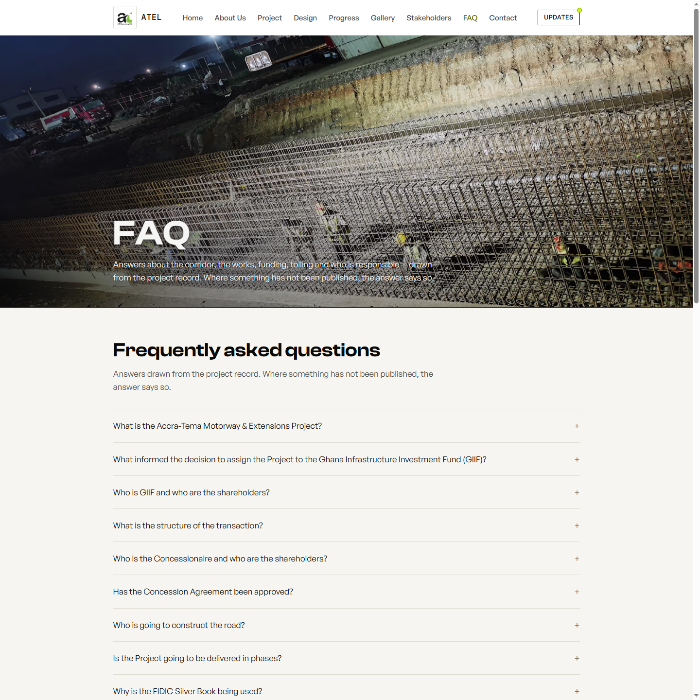

# ATEL Website — Developer's Guide

*A map from what you see on the live site to the exact file and code responsible for it. Written for the site's own owner, to build up TypeScript/Next.js fluency through this project rather than a generic tutorial.*

Generated 1 September 2026, from the codebase as it stood at that point. Screenshots are from a local production build (`pnpm build && pnpm start`) — pixel-identical to what's deployed, since it's the same code and content.

---

## Table of contents

1. [Orientation](#1-orientation)
   - [1.1 Root folder structure](#11-root-folder-structure)
   - [1.2 What is CLAUDE.md?](#12-what-is-claudemd)
   - [1.3 The core pattern: content, tokens, motion](#13-the-core-pattern-content-tokens-motion)
2. [Page-by-page guide](#2-page-by-page-guide)
   - [Home](#home-) · [About Us](#about-us-about) · [Project](#project-project) · [Design](#design-design) · [Progress](#progress-progress) · [Gallery](#gallery-gallery) · [Stakeholders](#stakeholders-stakeholders) · [Contact](#contact-contact) · [FAQ](#faq-faq)
3. [How do I make a common change?](#3-how-do-i-make-a-common-change)
4. [TypeScript / React glossary — grounded in this codebase](#4-typescript--react-glossary--grounded-in-this-codebase)
5. [Appendix: quick file index](#5-appendix-quick-file-index)

---

## 1. Orientation

### 1.1 Root folder structure

```
src/
  app/         → routes (Next.js App Router — one folder per URL)
  components/  → the UI, organized by page + shared building blocks
  content/     → every real-world fact, as typed TypeScript
  lib/         → shared code that isn't content and isn't UI
  styles/      → design tokens (globals.css)
public/        → files served as-is at the site's root
```

**`src/app/`** — this is Next.js's *App Router*: the folder structure **is** the URL structure. `src/app/(site)/progress/page.tsx` serves at `/progress`. The `(site)` folder is a **route group** — parentheses mean "group these routes together, but don't add `/site` to the URL." Every page under `(site)/` shares one `layout.tsx` (the header, footer, and page-transition wrapper you see on every page). `page.tsx` inside a folder is the actual page content; `layout.tsx` is the chrome wrapped around it.

**`src/components/`** — organized by *where it's used*, not by *what kind of thing it is*. You'll find a folder per page area (`home/`, `project/`, `design/`, `progress/`, `gallery/`, `stakeholders/`, `contact/`, `corridor/`), plus a few cross-cutting folders used by many pages: `ui/` (generic building blocks — buttons, the shared page hero, image/figure display), `motion/` (the scroll-reveal wrapper components every page uses), `layout/` (header, footer, nav link), `seo/` (the structured-data component for search engines).

**`src/content/`** — every real-world fact the site displays, as typed TypeScript objects and arrays, never as literal text buried in a component. `project.ts` is the single largest and most central file: organization identity, the stakeholder chain, progress figures, project facts (lengths, dates, cost), interchanges, the team, the board, contact details. Smaller, page-focused files sit alongside it: `about.ts` (About page copy), `design.ts` (Design page's section list), `gallery.ts` (every gallery item), `report.ts` (Progress page's detailed quantity tables), `media.ts` (the registry of every real photo and logo — file path, alt text, dimensions, one entry per image, referenced everywhere by a short key instead of a raw path), `navigation.ts` (the nav menu), `seo.ts` (per-route page titles/descriptions), `placeholder.ts` (the "not yet confirmed" marker system — see [§4](#4-typescript--react-glossary--grounded-in-this-codebase)), `structured-data.ts` (JSON-LD for search engines).

**`src/lib/`** — shared *code*, as distinct from shared *content*: `motion.ts` (the one file every animation's timing and easing comes from), `format.ts` (number/date formatting helpers — e.g. turning `1095` into `"1,095"`), `cn.ts` (a small helper for merging Tailwind class names conditionally), `site.ts` (the site's base URL, read from an environment variable), `page-metadata.ts` (turns a `seo.ts` entry into the actual Next.js `<head>` metadata), `og-image.tsx` (generates the image shown when the site is shared on social media).

**`src/styles/globals.css`** — every design value the site uses, as CSS custom properties: colors, spacing, the type scale, corner radius. This is where "design tokens" live — see [§1.3](#13-the-core-pattern-content-tokens-motion) for why that matters.

**`public/`** — files served exactly as they are, at the site's root URL. `public/images/` holds the real project photography and logos referenced from `media.ts`. `public/media/` holds video/img subfolders for heavier media.

> **Observation, not a fix (per your instructions, this is a note only):** `public/info/` currently holds six source documents — FAQ packs, a text-corrections doc, staff CVs, a progress-pictures doc — as raw `.xlsx`/`.docx` files. Anything under `public/` is served at a public URL once deployed (e.g. `yoursite.com/info/Ing%20Ben%20Sackey.docx` would work today). These look like internal reference material that ended up in the servable folder rather than being excluded from the deploy — worth knowing if you ever wonder why a file you thought was private shows up reachable.

### 1.2 What is CLAUDE.md?

`CLAUDE.md`, in the project root, is a plain-language instructions file that Claude Code (or any compatible AI coding assistant) reads automatically at the start of every session in this repo. It is **not enforced by the compiler or by Next.js** — nothing breaks if it's wrong or out of date. It's a convention document, and it only helps you if it's kept current.

What it holds, in this project: the confirmed company name and org-chart roles (so an assistant doesn't guess or invent them), the source-of-truth policy (the client's Monthly Progress Report wins over anything else, with a stated exception noted when a newer, better-documented client instruction supersedes it), the verified numeric facts (contract price, corridor length, dates, progress percentages) with their sourcing, and a set of coding rules specific to this project (TypeScript strict, no raw hex colors, all motion from one file, mobile-first, etc.) — most of which you've now seen reflected directly in the code in [§1.1](#11-root-folder-structure).

It's written with dated "supersedes" notes whenever a fact changes (e.g. a name confirmation superseding an earlier one), so it functions as a running paper trail of what the client has confirmed and when — useful for you too, not just an assistant, when you want to know *why* something reads the way it does.

> **Observation:** at the time this guide was generated, a few of `CLAUDE.md`'s own "Verified facts" were already a step behind the live site — the site correctly reflects a documented 28–29 August 2026 client correction (company name back to "A.T. Expressway Ltd.", role as "Concessionaire", progress at 52%) that hadn't yet been folded back into `CLAUDE.md`'s text. Not a site bug — the code and content are right — just a reminder that this file needs a manual refresh when facts change, the same as any other document.

### 1.3 The core pattern: content, tokens, motion

Three rules run through this entire codebase. All three exist for the same underlying reason: **so that changing a fact, a color, or a feel later doesn't require reading or risking the component code that renders it.**

**Content lives in `src/content/`, never hardcoded in a component.** A component like the Progress page doesn't contain the string `"52%"` anywhere — it reads `progress.overallPercentComplete` from `project.ts` and renders whatever that currently is. Why this matters for you: if you want to update a percentage, a name, or a paragraph, you're editing a plain data file, not JSX. You can't accidentally break the page's layout or logic while fixing a typo, and the same fact reused on multiple pages (the corridor length, the organization's name) only ever needs to change in one place to update everywhere it appears.

**Design values live in `globals.css` as tokens, never as raw hex codes in a component.** A component says `bg-surface` or `text-fg-muted`, never `#f6f5f1`. The token name describes *what role* the color plays ("the surface a card sits on"), not what it literally is — which is what makes the site's light/dark theme switching work at all: the same class resolves to a different real color depending on whether its section has `data-theme="dark"` on it. If this project ever needed a palette-wide adjustment, it happens in one file, and every component picks it up automatically, correctly, in both themes.

**Motion comes from one shared file, `src/lib/motion.ts`.** Every fade, slide, and count-up on the site references the same handful of exported durations and easings, rather than each component inventing its own timing. Why this matters: it keeps the whole site feeling like one consistent thing rather than a patchwork of animation styles, and it's the one place the accessibility rule ("everything must respect `prefers-reduced-motion`") has to be enforced correctly, instead of every component author needing to remember it themselves.

---

## 2. Page-by-page guide

Each page below follows the same shape: a screenshot, its route and file, the components it's built from, exactly where its content comes from, and anything notable about how it's built.

### Home (`/`)


**Route / file:** `/` → `src/app/(site)/page.tsx`

**Key components** (all in `src/components/home/`):
| Component | File | Notes |
|---|---|---|
| `Hero` + `HeroSlider` | `hero.tsx`, `hero-slider.tsx` | **Client Component** — auto-advancing image slider with prev/next/dot controls |
| `Intro` | `intro.tsx` | |
| `AboutPreview` | `about-preview.tsx` | |
| `CorridorTimeline` | `corridor-timeline.tsx` | **Client Component** — the scroll-driven corridor slideshow |
| `Statistics` | `statistics.tsx` | **Client Component** — the segmented stat switcher |
| `InterchangeProgress` | `interchange-progress.tsx` | |
| `DesignPreview` | `design-preview.tsx` | |
| `GalleryPreview` | `gallery-preview.tsx` | |
| `Partners` | `partners.tsx` | |
| `TeamPreview` | `team-preview.tsx` | **Client Component** |
| `ClosingCta` | `closing-cta.tsx` | |

**Content sources:** `organization`, `projectFacts`, `progress` (hero figures), `sectionStatGroups` (Statistics), `interchanges`/`progress` (InterchangeProgress), `laneConfiguration` (DesignPreview), `stakeholders` (Partners), `team` (TeamPreview) — all from `project.ts`; `aboutIntro`/`visionMission` from `about.ts`; `galleryItems` from `gallery.ts` (CorridorTimeline's slideshow reuses gallery photos, filtered to construction shots, rather than holding its own image list).

**Notable:** Home is effectively a highlights reel — it's the one page that touches nearly every content file in the project, because it previews every other page. The hero's four rotating photos each carry their own overlay-darkness setting (`scrimIntensity`, defined per slide in `hero.tsx`) since they vary naturally in brightness — the darkening isn't one flat setting for all four.

---

### About Us (`/about`)


**Route / file:** `/about` → `src/app/(site)/about/page.tsx`

**Key components:** `PageHero` (`src/components/ui/page-hero.tsx`), `ViewportReveal` (`src/components/motion/viewport-reveal.tsx`), `PlaceholderNotice`, `CtaLink` — all generic, shared components. Unlike most other pages, About doesn't have its own dedicated component folder — every section on the page is written directly inside `page.tsx` rather than broken into named subcomponents.

**Content sources:** `organization` (`project.ts`) for the org name and logo; `aboutIntro`, `visionMission`, `approach`, `investmentHighlights`, `whyAtel`, `internalStrengths`, `beyondTheCorridor` — all from `src/content/about.ts`.

**Notable:** the entire page is a **Server Component** (no `"use client"` anywhere in `page.tsx`) — even though it uses `ViewportReveal`, which is itself a Client Component internally. That's not a contradiction: a Server Component can render Client Components as children just fine. The boundary is per-file, not per-page — see [§4](#4-typescript--react-glossary--grounded-in-this-codebase) for a fuller explanation.

---

### Project (`/project`)



**Route / file:** `/project` → `src/app/(site)/project/page.tsx`

**Key components:** `PageHero`; `FullScope` (`src/components/project/full-scope.tsx`) — the "whole plan at a glance" summary; `CorridorExplorer` (`src/components/corridor/corridor-explorer.tsx`) — **Client Component**, the interactive draggable corridor map; `Figure` (`src/components/ui/figure.tsx`) — the tabular-number display used for section lengths.

**Content sources:** `sections`, `projectFacts`, `scopeOfWorks` from `project.ts`; `sectionStatGroups` also feeds `FullScope`.

**Notable — observation, not a fix:** the six "why this project matters" reason cards (`Increased mobility and accessibility`, etc.) and the long "why the motorway is being reconstructed" paragraphs are written as literal strings directly inside `page.tsx`, not sourced from `src/content/`. This is one of the few places on the site where the "content never lives in a component" rule isn't followed — worth knowing if you ever go looking in `project.ts` for that copy and can't find it.

---

### Design (`/design`)



**Route / file:** `/design` → `src/app/(site)/design/page.tsx`

**Key components:** `PageHero`; `DesignSectionCard` (`src/components/design/design-section.tsx`) — one card component reused for every section on the page.

**Content sources:** `corridorOverview`, `interchangeSections`, `structureSections` from `src/content/design.ts`; `interchanges` and `progress.workPackages` from `project.ts` (to attach a live completion percentage to each interchange card).

**Notable:** the page builds one combined list — the corridor overview, then every interchange, then every structure — and renders it through the same `DesignSectionCard`, alternating which side the image sits on (`reverse={index % 2 === 1}`) purely from the item's position in that list. One component, one data-driven loop, instead of separately hand-laid-out sections.

---

### Progress (`/progress`)



**Route / file:** `/progress` → `src/app/(site)/progress/page.tsx`

**Key components:** `PageHero`; `AnimatedFigure` (`src/components/ui/animated-figure.tsx`) — the count-up percentage; `StructureProgress` (`src/components/progress/structure-progress.tsx`) — **Client Component**; `MilestoneTimeline` (`src/components/progress/milestone-timeline.tsx`); `BulletinFeed` (`src/components/progress/bulletin-feed.tsx`).

**Content sources:** this is the most content-file-heavy page on the site — `progress`, `projectFacts`, `interchanges`, `activityHighlights`, `latestMonthlyUpdate` from `project.ts`; `structureDesignImages` from `structure-media.ts`; `REPORT_LABEL`, `earthworks`, `concreteWorks`, `drainage`, `footbridges`, `considerations` from `report.ts`.

**Notable:** a real, live example of the "placeholder" safety pattern in action — `const overallPct = isPlaceholder(progress.overallPercentComplete) ? 46 : progress.overallPercentComplete;` — the page has to explicitly handle the case where that figure hasn't been confirmed yet, rather than assuming it's always a real number. See [§4](#4-typescript--react-glossary--grounded-in-this-codebase) for what that pattern actually is.

---

### Gallery (`/gallery`)



**Route / file:** `/gallery` → `src/app/(site)/gallery/page.tsx`

**Key components:** `GalleryFilter` (`src/components/gallery/gallery-filter.tsx`) — **Client Component**; `GalleryCard` (`src/components/gallery/gallery-tile.tsx`) — plain Server Component; `GalleryLightbox` (`src/components/gallery/gallery-lightbox.tsx`) — **Client Component**; `SafeBoundary` (`src/components/gallery/safe-boundary.tsx`) wraps the filter and the lightbox independently.

**Content sources:** `galleryItems` and `resolveGalleryItems()` from `src/content/gallery.ts`.

**Notable:** deliberately built so the photo grid itself is pure, plain server-rendered HTML that is fully visible with JavaScript off — filtering by category is done with a CSS attribute toggle (`data-gallery-filter`) rather than by conditionally rendering tiles. Each interactive piece (the filter buttons, the lightbox) is wrapped in its own `SafeBoundary` error boundary specifically so that if either one fails to load or crashes on the client, the grid underneath is unaffected. The code's own comments note this is a deliberate reaction to a past incident, not an accident of the framework — worth knowing before "simplifying" this page, since the separation is the point.

---

### Stakeholders (`/stakeholders`)



**Route / file:** `/stakeholders` → `src/app/(site)/stakeholders/page.tsx`

**Key components:** `StakeholderOrg` (`src/components/stakeholders/stakeholder-org.tsx`) — one card per organization in the delivery chain; `BoardMemberCard`, `TeamMemberCard` (same folder).

**Content sources:** `stakeholders`, `team`, `boardMembers`, `epcPersonnel`, `oversightBodies`, `specialistContractors` — all from `project.ts`.

**Notable:** a good example of *adapting* content at the page level instead of duplicating it. `page.tsx` builds a `CHAIN` array (the organizations, top to bottom) and a `PEOPLE_BY_ORG` lookup that filters `boardMembers` by their `affiliation` field and re-maps `team` into the shape the org cards expect — the same underlying `team` records also drive the Project Team section further down this same page and the Home page slider, so a name, title, or photo is only ever edited once in `project.ts` no matter how many places display it.

---

### Contact (`/contact`)



**Route / file:** `/contact` → `src/app/(site)/contact/page.tsx`

**Key components:** `ContactDetails` (`src/components/contact/contact-details.tsx`); `EnquirySection` (`src/components/contact/enquiry-section.tsx`), which wraps `EnquiryForm` (**Client Component** — real form state) and `CorridorMap` (plain Server Component — a static illustration of the corridor, not an interactive map or an office pin).

**Content sources:** `contact` (email, phone, address, and the ordered `social` array) from `project.ts`.

**Notable:** both `EnquiryForm` here and `NewsletterSignup` (in the footer, shown on every page) are deliberately inert right now — there's no submission endpoint wired up yet. Each one is genuinely `disabled` in the markup (not just styled to look disabled) and says so on-page, rather than silently pretending a submission worked.

---

### FAQ (`/faq`)



**Route / file:** `/faq` → `src/app/(site)/faq/page.tsx`

**Key components:** `FaqSection` (`src/components/contact/faq-section.tsx`) — the accordion.

**Content sources:** every *number* cited inside an answer (a percentage, a date, a length) is pulled from `project.ts` (`progress`, `projectFacts`, `sections`, `scopeOfWorks`, `stakeholders`, `specialistContractors`, `reconstructionRationale`, `laneConfiguration`) — never typed by hand into an answer.

> **Observation, not a fix:** the *questions themselves*, and the surrounding answer prose, are written directly inside `faq-section.tsx` — not in `src/content/`. This is the one page where you won't find the visible text in a content file at all; if you ever want to add or edit a question, the file you want is the component itself (see [§3](#3-how-do-i-make-a-common-change)).

---

## 3. How do I make a common change?

Each of these points at the exact file and field — no component logic should need to change for any of them.

**Change a piece of text or a number.** Find the field in `src/content/project.ts` (or the page's dedicated content file — see the page-by-page mapping above for which file feeds which page), edit the value, save. Two named exceptions, both flagged above: `/project`'s six "why this matters" reason cards and long explanatory paragraphs, and every FAQ question/answer — those live directly in their component files (`src/app/(site)/project/page.tsx` and `src/components/contact/faq-section.tsx`) rather than in `src/content/`.

**Swap an image.** (1) Add the new file to `public/images/`. (2) Add or edit its entry in `src/content/media.ts` (the `mediaRegistry` object) — this is where it gets a short key, its file path, alt text, and real width/height. (3) Reference it by that key wherever it's used (a `PageHero`'s `media="..."` prop, or a `mediaRegistry.yourKey` lookup inside a component). Don't just overwrite a file at its existing filename in place — the width/height recorded in `media.ts` needs to match the real file, or Next.js's image sizing can distort or letterbox it.

**Change a color — and why to reuse a token, not a new hex value.** Never write a new hex code, even for what feels like a one-off. Open `src/styles/globals.css`, find the closest existing semantic token (`bg-surface`, `bg-surface-raised`, `text-fg`, `text-fg-muted`, `border-hairline`, `text-accent`, and so on — see the file's own header comment for the full map), and use its Tailwind class in the component instead. The reason: these tokens automatically resolve to a *different* real color depending on whether the section they're in is light or dark (`data-theme="dark"`) — a hardcoded hex won't do that, and would look wrong in one of the two themes. It also means a future site-wide color change happens in one file instead of a search-and-replace across every component.

**Add or edit an FAQ entry.** Open `src/components/contact/faq-section.tsx`. Find the `clientFaqs` array (or the second, project-record array further down the same file) and add an object with an `id`, a `question` string, and an `answer` (which can itself reference real fields from `project.ts`, the way the existing entries do, rather than typing a number by hand). Remember: this is the one content type that lives in a component file, not `src/content/`.

**Update a progress percentage.** `progress.overallPercentComplete` and each entry's `percentComplete` inside `progress.workPackages[]`, both in `src/content/project.ts`. Update `progress.asOf` and `progress.signOffSource` at the same time, so the "as of" date shown on the page stays accurate — follow the existing comment convention in that file, which cites a specific, dated source string (e.g. `"Client meeting, 28 August 2026"`) rather than leaving the date to guesswork.

---

## 4. TypeScript / React glossary — grounded in this codebase

### `interface`

A shape contract: it describes exactly which fields an object must have, and what type each one is. Here's a real one, from `src/content/project.ts`:

```ts
export interface Stakeholder {
  readonly name: string;
  readonly role: string;
  readonly gloss: string;
  readonly logo: MediaKey;
  readonly website?: string;
}
```

Every object that claims to be a `Stakeholder` (like `employer` or `stakeholders.epcContractor`) is checked against this shape *before the site ever builds*. Forget the `logo` field, or accidentally put a number where `role` expects a string, and TypeScript stops you right there in your editor — not after you've shipped a broken page. That's the whole value of a static type system here: catching a mistake in a content file the moment you make it, instead of discovering it as a blank spot on the live site.

### `as const`

Take this, from `src/lib/motion.ts`:

```ts
export const easing = {
  standard: [0.4, 0, 0.2, 1],
  out: [0, 0, 0.2, 1],
  in: [0.4, 0, 1, 1],
} as const;
```

Without `as const`, TypeScript would widen `standard` to a general `number[]` — "an array of numbers, could be any length, could change." With `as const`, TypeScript instead locks in *exactly* this — a fixed 4-item tuple of these specific literal values, and the whole object becomes deeply read-only. That matters concretely here because the animation library this project uses expects an exact 4-number tuple for a cubic-bezier curve, not "some array of numbers" — `as const` is what makes that type check pass. You'll see `as const` all over `src/content/` for the same underlying reason: it turns "a list of strings" into "exactly these values, in exactly this order, and nothing can silently reassign them."

### The `placeholder()` pattern

From `src/content/placeholder.ts`:

```ts
export function placeholder<T>(label: string, fallback: T): Placeholder<T> {
  return { [PLACEHOLDER]: true, label, fallback };
}

export function isPlaceholder<T>(value: T | Placeholder<T>): value is Placeholder<T> {
  return typeof value === "object" && value !== null && PLACEHOLDER in value;
}
```

Several fields in `project.ts` are typed as `T | Placeholder<T>` — meaning "either the real fact, or an explicit marker that it isn't known yet." A component reading one of these fields is *required* to call `isPlaceholder()` and handle both branches — TypeScript won't let it just assume the value is real and render it directly. You saw this live on the Progress page:

```ts
const overallPct = isPlaceholder(progress.overallPercentComplete) ? 46 : progress.overallPercentComplete;
```

The point of this pattern: it makes it structurally impossible for an unconfirmed fact to silently reach the page as if it were confirmed. If the client hasn't supplied a figure yet, the type system forces whoever writes the component to decide, explicitly, what "not yet known" looks like on screen — rather than that decision being left to chance (or to `undefined` leaking through as blank space).

### Server Component vs. Client Component

By default, **every component in this project is a Server Component.** It runs once, on the server (or at build time, since most pages here are static), produces HTML, and ships **zero JavaScript of its own to the browser.** It cannot use `useState`, `useEffect`, `onClick`, or any hook that needs the browser to work.

A file becomes a **Client Component** only when it starts with the literal string `"use client"` on its first line — and that should only happen when the component genuinely needs interactivity: state that changes in response to user input, a browser API, an event handler, or a hook (even an indirect one) that depends on those.

- **Real Server Component example:** the entire `src/app/(site)/about/page.tsx`. No `"use client"` anywhere in the file. It reads content and renders it — nothing on the page depends on state changing after the initial render.
- **Real Client Component example:** `src/components/home/hero-slider.tsx`. It opens with `"use client"`, and for good reason — it holds `useState` for which slide is currently showing, runs a `setInterval` to auto-advance, and wires up `onClick` handlers for the previous/next buttons and the slide dots. None of that is possible in a Server Component.

The one nuance worth internalizing: a Server Component **can** render a Client Component as a child. `about/page.tsx` uses `ViewportReveal` (a Client Component, for its scroll-triggered animation) throughout, without itself becoming a Client Component — the `"use client"` boundary lives in `ViewportReveal`'s own file, not in every file that happens to use it. The rule is per-file, not "does anything on this page ever involve a Client Component."

---

## 5. Appendix: quick file index

A flat lookup for "where do I find X," without re-reading a whole page section.

| Looking for… | File |
|---|---|
| Company name, roles, contract chain | `src/content/project.ts` (`organization`, `stakeholders`) |
| Contract price, corridor length, dates | `src/content/project.ts` (`projectFacts`) |
| Overall progress % / per-structure % | `src/content/project.ts` (`progress`) |
| Board members, executives | `src/content/project.ts` (`boardMembers`) |
| Team / consultant personnel | `src/content/project.ts` (`team`) |
| Email, phone, address, social links | `src/content/project.ts` (`contact`) |
| About page copy | `src/content/about.ts` |
| Design page sections | `src/content/design.ts` |
| Gallery photos | `src/content/gallery.ts` |
| Progress page's quantity tables | `src/content/report.ts` |
| Every real photo/logo (path, alt text) | `src/content/media.ts` |
| Nav menu items | `src/content/navigation.ts` |
| Page titles / meta descriptions | `src/content/seo.ts` |
| The "not yet confirmed" marker system | `src/content/placeholder.ts` |
| FAQ questions and answers | `src/components/contact/faq-section.tsx` *(exception — not in `src/content/`)* |
| "/project" reason cards & long paragraphs | `src/app/(site)/project/page.tsx` *(exception — not in `src/content/`)* |
| Animation durations / easings | `src/lib/motion.ts` |
| Color tokens, type scale, theme logic | `src/styles/globals.css` |
| Nav header | `src/components/layout/site-header.tsx` |
| Footer | `src/components/layout/site-footer.tsx` |
| Shared page hero (image + title + subtitle) | `src/components/ui/page-hero.tsx` |
| Scroll-reveal wrapper | `src/components/motion/viewport-reveal.tsx` |
| Site-wide instructions for an AI coding assistant | `CLAUDE.md` |
